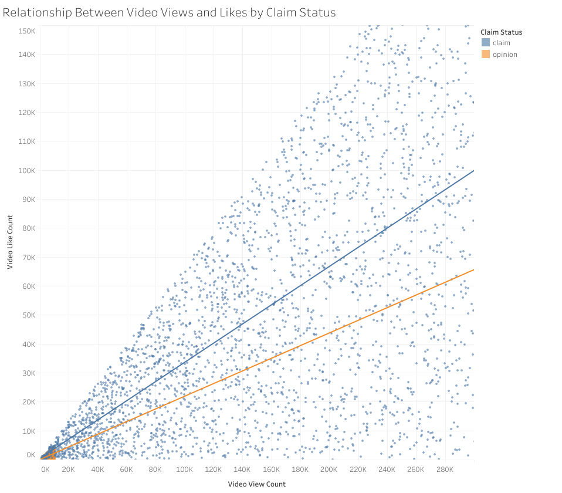

# TikTok Claims Analysis

## Project Overview

This educational project examines synthetic TikTok video data using Python and pandas. The analysis was completed as part of the Google Advanced Data Analytics Professional Certificate.

The broader project goal is to prepare data for a future machine learning model that can classify videos as either claims or opinions.

## Business Problem

TikTok receives reports about videos containing claims and opinions. A classification model could help moderators prioritize reported content and reduce the review backlog.

This stage of the project focuses on inspecting, organizing, and understanding the data before exploratory data analysis and model development.

## Dataset

The dataset contains 19,382 TikTok video records and 12 original columns.

The variables include:

- Claim status
- Video duration
- Video transcription text
- Verification status
- Author ban status
- Video views
- Video likes
- Video shares
- Video downloads
- Video comments

The dataset is synthetic and was created for educational purposes. It does not represent TikTok's actual internal data.

## Tools and Skills

- Python
- pandas
- NumPy
- Jupyter Notebook
- Data inspection
- Descriptive statistics
- Boolean filtering
- Grouping and aggregation
- Feature engineering
- Exploratory data analysis preparation
- Matplotlib
- Seaborn
- Tableau Public
- Data visualization
- Outlier analysis
  
## Tasks Completed

- Imported the dataset into a pandas DataFrame
- Reviewed the first rows of the data
- Inspected column data types and non-null values
- Calculated descriptive statistics
- Compared claim and opinion videos
- Examined engagement by author ban status
- Created engagement-rate variables
- Prepared recommendations for future modeling

## New Variables Created

- `likes_per_view`
- `comments_per_view`
- `shares_per_view`

These variables help compare engagement across videos with different total view counts.

## Key Findings

- The dataset is nearly balanced between claim and opinion videos.
- There are 9,608 claim videos and 9,476 opinion videos.
- Claim videos receive substantially more views than opinion videos.
- Claim videos also have higher like, comment, and share engagement rates.
- Videos from banned and under-review authors generally receive more engagement than videos from active authors.
- Claim status, author ban status, and engagement measurements may be useful variables for future classification modeling.

## Recommended Next Steps

- Perform more detailed exploratory data analysis
- Investigate and handle missing values
- Examine correlations among engagement variables
- Evaluate whether additional features should be created
- Select useful predictors
- Build and evaluate a classification model

## Note

This is an educational project based on synthetic data and course materials from the Google Advanced Data Analytics Professional Certificate.
## Project Progression

### Course 1: Data Inspection and Organization

- Imported the TikTok dataset into pandas
- Reviewed data types and missing values
- Calculated descriptive statistics
- Compared claim and opinion videos
- Examined author status and engagement patterns
- Prepared the dataset for future analysis

### Course 2: Exploratory Data Analysis and Visualization

- Performed exploratory data analysis using Python
- Created boxplots and histograms for video duration, views, likes, comments, shares, and downloads
- Compared claim status by verification and author ban status
- Analyzed median view counts by claim and author status
- Examined total views generated by claims and opinions
- Identified potential outliers using median and interquartile-range thresholds
- Created scatterplots showing the relationship between views and likes
- Built a Tableau visualization for stakeholder communication

## Key Course 2 Findings

- Claim videos received substantially higher engagement than opinion videos.
- The median claim video had approximately 501,555 views, compared with approximately 4,953 views for opinion videos.
- Authors who were banned or under review had much higher median view counts than active authors.
- Views, likes, shares, downloads, and comments were strongly right-skewed.
- Many high-engagement observations were statistical outliers, but they may represent valid viral content rather than data errors.
- Engagement variables may be useful predictors in a future claim-classification model.

## Tableau Visualization

The Tableau scatterplot examines the relationship between video views and video likes by claim status. The visualization indicates that claim videos generally have stronger engagement patterns than opinion videos.

## Project Files

### Course 1

- `tiktok_claims_analysis.ipynb` — initial inspection and organization notebook

### Course 2

- `course-2-eda/tiktok_course2_eda.ipynb` — exploratory data analysis notebook
- `course-2-eda/tiktok_scatterplot.png` — Tableau visualization
